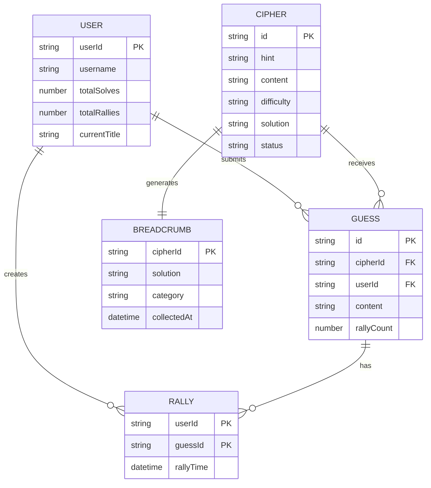
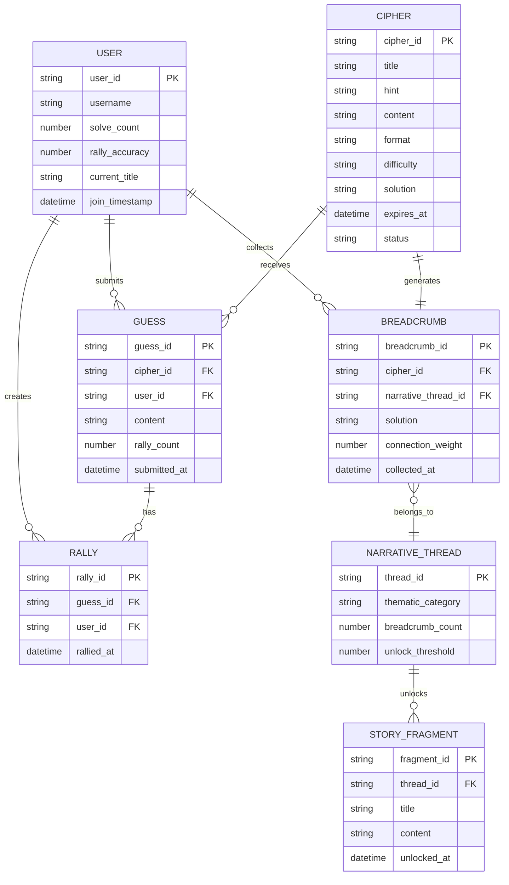

 # 2701 ARG Platform - Design Document

## Overview

2701 is a Reddit-native ARG platform built exclusively on Devvit Web that transforms r/2701 into a collaborative cipher-solving community. The system generates hourly cryptographic puzzles tied to real-world events, enables community consensus through rally mechanics, and builds toward narrative revelations through breadcrumb collection.

### Design Constraints & Scope

**MVP Scope (Phase 1)**:
- Basic cipher generation and display
- Rally mechanics with real-time updates
- User profiles and leaderboards
- Simple breadcrumb collection
- Mobile-responsive interface

**Devvit Web Limitations**:
- 100 concurrent users per realtime channel maximum
- KV Store: 10MB per key, 100GB total, 1000 ops/second
- Webview domains must be pre-approved HTTPS
- No external server hosting for core functionality
- Reddit OAuth only for authentication

**Technical Constraints**:
- Bundle size <500KB for mobile performance
- Real-time updates <2 seconds via Devvit channels
- Fallback to polling when realtime unavailable
- All audio requires user gesture to play

## Architecture

### Simplified Devvit Web Architecture

```
Reddit Post (r/2701)
├── Splash Screen (Devvit)
└── Webview Container
    ├── React Frontend (Static Bundle)
    │   ├── Dashboard (Cipher Grid + Leaderboard)
    │   ├── CipherPage (Display + Guess Input)
    │   └── ProfileView (Stats + Badges)
    └── Devvit Backend (Server Functions)
        ├── Scheduler (Hourly Cipher Drops)
        ├── Triggers (Comment Processing)
        ├── KV Operations (Data Persistence)
        └── Realtime (Rally Updates)

External Services (Fallback Only)
├── Perplexity API (Event Fetching)
├── Gemini API (Cipher Generation)  
└── Pre-generated Cipher Pool (Primary)
```

### Data Flow

1. **Cipher Generation**: Devvit scheduler runs hourly → Calls AI APIs with 30s timeout → Falls back to pre-generated pool → Stores in KV → Posts to subreddit
2. **User Interaction**: User clicks post → Splash loads → Webview opens → React app fetches data from KV via Devvit
3. **Rally Mechanics**: User clicks rally → Devvit trigger processes → KV counter increments → Realtime update broadcasts → All clients update UI
4. **Cipher Resolution**: Timer expires → Devvit scheduler determines winner → Breadcrumb generated → Solution posted as comment

## User Interface Design

### Wireframes & Layout

**Dashboard Layout (Mobile-First)**:
```
┌─────────────────────────────┐
│ 🔓 2701 VAULT    [🔊] [👤] │ ← Header (44px height)
├─────────────────────────────┤
│ 🏆 TOP SOLVERS              │ ← Leaderboard (collapsed)
│ MasterLock: 25 • CipherSage │   (expands on tap)
├─────────────────────────────┤
│ ┌─────────────┐ ┌─────────┐ │ ← Cipher Grid (2-col mobile)
│ │"We live in  │ │ TEASER  │ │   (3-col desktop)
│ │ a bubble"   │ │ 14:32   │ │
│ │ HARD • 2:15 │ │ Next... │ │
│ │ 42 guesses  │ │         │ │
│ └─────────────┘ └─────────┘ │
│ ┌─────────────┐ ┌─────────┐ │
│ │"Hidden in   │ │"Follow  │ │
│ │ plain sight" │ │the $$$" │ │
│ │ EASY • 0:45 │ │ MED•1:30│ │
│ │ 18 guesses  │ │ 7 guess │ │
│ └─────────────┘ └─────────┘ │
└─────────────────────────────┘
```

**Cipher Page Layout**:
```
┌─────────────────────────────┐
│ ← Back    "We live in..."   │ ← Header with back button
├─────────────────────────────┤
│        ⏰ 02:15:33          │ ← Countdown timer (large)
├─────────────────────────────┤
│ ┌─────────────────────────┐ │ ← Cipher content area
│ │ URYYB JBEYQ GUVF VF N   │ │   (text/image/audio)
│ │ GRFG PVCURE SBE GUR     │ │
│ │ PBZZHAVGL GB FBYIR      │ │
│ └─────────────────────────┘ │
├─────────────────────────────┤
│ [Your guess here...] [SEND] │ ← Guess input (bottom)
├─────────────────────────────┤
│ 💡 HELLO WORLD        [42] │ ← Guess list with rally
│ 🔥 BUBBLE ECONOMY     [38] │   counts (scrollable)
│ 💭 TEST CIPHER        [12] │
│ 💭 WRONG ANSWER       [3]  │
└─────────────────────────────┘
```

## Core Components

### 1. Cipher Management System

**Devvit Scheduler (Hourly Cipher Generation)**:
```typescript
// Simplified cipher generation with clear fallback
Devvit.addSchedulerJob({
  name: 'generateCipher',
  cron: '0 * * * *', // Every hour
  onRun: async (event, context) => {
    try {
      // Try AI generation (30s timeout)
      const cipher = await generateWithAI(context)
      await storeCipher(cipher, context)
    } catch (error) {
      // Fallback to pre-generated pool
      const cipher = await selectFallbackCipher(context)
      await storeCipher(cipher, context)
    }
    
    // Create Reddit post
    await context.reddit.submitCustomPost({
      subredditName: 'r/2701',
      title: `Cipher #${cipher.id}: "${cipher.hint}"`,
      splash: createSplashConfig(cipher)
    })
  }
})

async function generateWithAI(context: Context): Promise<Cipher> {
  // Fetch recent events (Perplexity)
  const events = await fetchEvents(['privacy', 'auditing', 'patents'])
  
  // Generate cipher (Gemini)
  const cipher = await createCipher(events[0])
  
  // Validate and return
  if (!validateCipher(cipher)) throw new Error('Invalid cipher')
  return cipher
}
```

### 2. Rally System (Real-time Updates)

**KV-Based Rally Processing**:
```typescript
// Atomic rally increment with rate limiting
async function processRally(guessId: string, userId: string, context: Context) {
  const rateLimitKey = `rally_limit:${userId}`
  const rallyKey = `rallies:${guessId}`
  
  // Check rate limit (10 rallies per minute)
  const currentCount = await context.redis.get(rateLimitKey) || 0
  if (currentCount >= 10) {
    throw new Error('Rate limit exceeded')
  }
  
  // Atomic operations
  const pipeline = context.redis.pipeline()
  pipeline.zincrby(rallyKey, 1, userId)
  pipeline.incr(rateLimitKey)
  pipeline.expire(rateLimitKey, 60)
  
  const results = await pipeline.exec()
  const newCount = results[0][1]
  
  // Broadcast update via Devvit realtime
  await context.realtime.send('rally_update', {
    guessId,
    newCount,
    userId
  })
  
  return { success: true, newCount }
}
```

### 3. User Profile Management

**Simple Profile Schema**:
```typescript
interface UserProfile {
  userId: string
  username: string
  totalSolves: number
  totalRallies: number
  successfulRallies: number
  currentTitle: string
  joinDate: string
  lastActive: string
}

// Title calculation (simplified)
function calculateTitle(profile: UserProfile): string {
  const { totalSolves, successfulRallies, totalRallies } = profile
  const accuracy = totalRallies > 0 ? successfulRallies / totalRallies : 0
  
  if (totalSolves >= 25 && accuracy >= 0.7) return 'Cipher_Sage'
  if (totalSolves >= 10 && accuracy >= 0.5) return 'Master_Locksmith'
  if (totalSolves >= 5 && accuracy >= 0.3) return 'Locksmith'
  if (totalSolves >= 1) return 'Apprentice'
  return 'Novice'
}
```

## Data Models (Simplified)

### KV Store Schema

```typescript
// Minimal viable schemas for MVP

// User Profile (Key: profile:{user_id})
interface UserProfile {
  userId: string
  username: string
  totalSolves: number
  totalRallies: number
  successfulRallies: number
  currentTitle: string
  joinDate: string
  lastActive: string
}

// Active Cipher (Key: cipher:{cipher_id})
interface Cipher {
  id: string
  hint: string
  content: string
  format: 'text' | 'image' | 'audio'
  difficulty: 'easy' | 'medium' | 'hard'
  solution: string
  createdAt: string
  expiresAt: string
  status: 'active' | 'expired' | 'solved'
  guessCount: number
}

// Guess (Key: guess:{guess_id})
interface Guess {
  id: string
  cipherId: string
  userId: string
  content: string
  rallyCount: number
  timestamp: string
}

// Rally Counter (Sorted Set: rallies:{cipher_id})
// Members: user_id, Scores: 1 (binary - user rallied or not)

// Rate Limiting (Key: rate:{action}:{user_id}, TTL: 60s)
// Values: counter (number)

// Breadcrumb (Key: breadcrumb:{cipher_id})
interface Breadcrumb {
  cipherId: string
  solution: string
  thematicCategory: 'privacy' | 'auditing' | 'patents'
  collectedAt: string
}

// Global Stats (Key: global_stats)
interface GlobalStats {
  totalCiphers: number
  totalSolved: number
  activeUsers24h: number
  breadcrumbCount: number
}
```

### Data Relationships (Simplified)



## Implementation Details

### Frontend Components (React)

**Dashboard Component**:
```typescript
const Dashboard: React.FC = () => {
  const [ciphers, setCiphers] = useState<Cipher[]>([])
  const [leaderboard, setLeaderboard] = useState<UserProfile[]>([])
  const [audioEnabled, setAudioEnabled] = useState(false)
  
  useEffect(() => {
    // Fetch data from Devvit backend
    fetchActiveCiphers().then(setCiphers)
    fetchLeaderboard().then(setLeaderboard)
    
    // Subscribe to realtime updates
    const unsubscribe = subscribeToUpdates((update) => {
      if (update.type === 'rally') {
        updateCipherRallies(update.cipherId, update.guessId, update.newCount)
      }
    })
    
    return unsubscribe
  }, [])
  
  return (
    <div className="dashboard bg-gray-900 text-green-400 font-mono">
      <Header audioEnabled={audioEnabled} onToggleAudio={setAudioEnabled} />
      <CipherGrid ciphers={ciphers} />
      <Leaderboard users={leaderboard} />
    </div>
  )
}
```

**Cipher Card Component**:
```typescript
const CipherCard: React.FC<{ cipher: Cipher }> = ({ cipher }) => {
  const navigate = useNavigate()
  const timeRemaining = useCountdown(cipher.expiresAt)
  
  const handleClick = () => {
    // Play click sound if audio enabled
    playSound('click.mp3')
    navigate(`/cipher/${cipher.id}`)
  }
  
  return (
    <motion.div
      className="cipher-card bg-gray-800 p-4 rounded border border-gray-700 cursor-pointer"
      whileHover={{ scale: 1.02, borderColor: '#00ff88' }}
      whileTap={{ scale: 0.98 }}
      onClick={handleClick}
    >
      <div className="flex justify-between items-start mb-2">
        <h3 className="text-lg">"{cipher.hint}"</h3>
        <DifficultyBadge level={cipher.difficulty} />
      </div>
      <div className="flex justify-between text-sm text-gray-400">
        <span>{formatTime(timeRemaining)}</span>
        <span>{cipher.guessCount} guesses</span>
      </div>
    </motion.div>
  )
}
```

### Backend Implementation (Devvit)

**Main App Configuration**:
```typescript
// main.tsx
import { Devvit } from '@devvit/public-api'

Devvit.configure({
  webview: true,
  realtime: true,
  kvstore: true
})

// Custom post type for ciphers
Devvit.addCustomPostType({
  name: '2701-cipher',
  render: (context) => {
    return (
      <webview 
        source="index.html" 
        height="600px"
        width="100%"
      />
    )
  }
})

// Hourly cipher generation
Devvit.addSchedulerJob({
  name: 'generateCipher',
  cron: '0 * * * *',
  onRun: async (event, context) => {
    const cipher = await generateOrSelectCipher(context)
    await createCipherPost(cipher, context)
  }
})

// Process guess submissions via comments
Devvit.addTrigger({
  event: 'CommentSubmit',
  onEvent: async (event, context) => {
    if (event.comment?.body?.startsWith('GUESS:')) {
      await processGuess(event, context)
    }
  }
})

export default Devvit
```

**Cipher Generation Function**:
```typescript
async function generateOrSelectCipher(context: Context): Promise<Cipher> {
  try {
    // Try AI generation with timeout
    const timeoutPromise = new Promise((_, reject) => 
      setTimeout(() => reject(new Error('Timeout')), 30000)
    )
    
    const generationPromise = generateWithAI(context)
    const cipher = await Promise.race([generationPromise, timeoutPromise])
    
    return cipher as Cipher
  } catch (error) {
    // Fallback to pre-generated cipher
    console.warn('AI generation failed, using fallback')
    return await selectFallbackCipher(context)
  }
}

async function selectFallbackCipher(context: Context): Promise<Cipher> {
  const fallbackPool = await context.redis.get('fallback_ciphers')
  const ciphers = JSON.parse(fallbackPool || '[]')
  
  if (ciphers.length === 0) {
    throw new Error('No fallback ciphers available')
  }
  
  // Select random cipher and remove from pool
  const index = Math.floor(Math.random() * ciphers.length)
  const cipher = ciphers.splice(index, 1)[0]
  
  // Update pool
  await context.redis.set('fallback_ciphers', JSON.stringify(ciphers))
  
  return {
    ...cipher,
    id: `cipher_${Date.now()}`,
    createdAt: new Date().toISOString(),
    expiresAt: new Date(Date.now() + 4 * 60 * 60 * 1000).toISOString(), // 4 hours
    status: 'active'
  }
}
```

#### 3. Breadcrumb Engine

**Purpose**: Connect solved ciphers into narrative threads leading to final revelation

**Interface**:
```typescript
interface BreadcrumbEngine {
  generateBreadcrumb(cipher: Cipher, solution: string): Promise<Breadcrumb>
  calculateConnections(breadcrumb: Breadcrumb): Promise<Connection[]>
  checkUnlockThreshold(threadId: string): Promise<boolean>
  unlockStoryFragment(threadId: string): Promise<StoryFragment>
  buildMasterCipher(breadcrumbs: Breadcrumb[]): Promise<Cipher>
}

interface Breadcrumb {
  id: string
  narrativeThreadId: string
  cipherSourceHash: string
  solution: string
  thematicCategory: ThematicCategory
  connectionWeight: number
  collectedTimestamp: string
}
```

**Implementation Details**:
- Analyzes cipher solutions for thematic keywords and concepts
- Calculates connection weights using cosine similarity algorithms
- Groups breadcrumbs into narrative threads based on thematic categories
- Triggers story fragment unlocks when thread reaches 50 breadcrumbs
- Generates master cipher using breadcrumb solutions as encryption keys

#### 4. User Interface Components

**Dashboard Component**:
```typescript
interface DashboardProps {
  activeCiphers: Cipher[]
  teaserCipher?: Cipher
  leaderboard: LeaderboardEntry[]
  userProfile: UserProfile
  globalStats: GlobalStats
}

const Dashboard: React.FC<DashboardProps> = ({
  activeCiphers,
  teaserCipher,
  leaderboard,
  userProfile,
  globalStats
}) => {
  // Cyberpunk styling with CSS-in-JS
  const theme = {
    background: '#1a1a1a',
    accent: '#00ff88',
    warning: '#ff6b6b',
    font: 'JetBrains Mono'
  }
  
  return (
    <motion.div
      initial={{ opacity: 0 }}
      animate={{ opacity: 1 }}
      className="dashboard"
      style={{ backgroundColor: theme.background }}
    >
      <Header userProfile={userProfile} globalStats={globalStats} />
      <CipherGrid ciphers={activeCiphers} teaser={teaserCipher} />
      <Leaderboard entries={leaderboard} />
    </motion.div>
  )
}
```

**Cipher Card Component**:
```typescript
const CipherCard: React.FC<{ cipher: Cipher }> = ({ cipher }) => {
  const [isHovered, setIsHovered] = useState(false)
  
  return (
    <motion.div
      className="cipher-card"
      whileHover={{ scale: 1.02 }}
      whileTap={{ scale: 0.98 }}
      animate={cipher.isNew ? { scale: [1, 1.05, 1] } : {}}
      onHoverStart={() => setIsHovered(true)}
      onHoverEnd={() => setIsHovered(false)}
      style={{
        background: '#2d2d2d',
        border: isHovered ? '2px solid #00ff88' : '1px solid #444',
        boxShadow: isHovered ? '0 0 15px #00ff88' : 'none'
      }}
    >
      <div className="cipher-header">
        <h3>"{cipher.hint}"</h3>
        <DifficultyBadge level={cipher.difficulty} />
      </div>
      <div className="cipher-meta">
        <Timer expiresAt={cipher.expires_timestamp} />
        <GuessCount count={cipher.guessCount} />
      </div>
    </motion.div>
  )
}
```

### External Integrations

#### Reddit API Integration

**Authentication Flow**:
1. User clicks 2701 post → Devvit splash screen
2. Reddit OAuth validates user automatically
3. User context passed to webview via Devvit
4. All subsequent requests include Reddit user token

**Flair Management**:
```typescript
interface RedditIntegration {
  updateUserFlair(userId: string, title: string, solves: number): Promise<void>
  postSolutionComment(cipherId: string, solution: string, winner: string): Promise<void>
  createMilestonePost(milestone: Milestone): Promise<void>
}
```

#### AI Service Integration

**Perplexity Event Fetcher**:
```typescript
const fetchRecentEvents = async (theme: ThematicCategory): Promise<Event[]> => {
  const searchQueries = {
    privacy: "ECPA digital privacy surveillance encryption recent news",
    auditing: "PCAOB SOX financial auditing compliance recent news", 
    patents: "USPTO patent law intellectual property recent news"
  }
  
  const response = await perplexityAPI.search({
    query: searchQueries[theme],
    count: 5,
    freshness: "week"
  })
  
  return response.results.map(result => ({
    title: result.title,
    summary: result.snippet,
    url: result.url,
    timestamp: result.published_date,
    relevanceScore: calculateRelevance(result.snippet, theme)
  }))
}
```

**Gemini Cipher Creator**:
```typescript
const generateCipherFromEvent = async (event: Event, difficulty: DifficultyLevel): Promise<Cipher> => {
  const prompt = `Create a ${difficulty} cryptographic cipher based on this recent event: ${event.summary}. 
  The cipher should incorporate themes from ${event.thematicCategory} and be solvable by a community of puzzle enthusiasts.
  Format: ${selectRandomFormat()}
  Include a cryptic hint (max 50 characters) and embed the solution within the cipher content.`
  
  const response = await geminiAPI.generateContent({
    model: "gemini-pro",
    prompt: prompt,
    temperature: 0.7,
    maxTokens: 1000
  })
  
  return parseCipherResponse(response.text, event)
}
```

## Data Models

### Core Data Entities

#### User Profile Model
```typescript
interface UserProfile {
  userId: string
  username: string
  solveCount: number
  successfulRallies: number
  totalRallies: number
  breadcrumbsCollected: string[]
  currentTitle: string
  availableTitles: string[]
  averageSolveTime: number
  difficultyBreakdown: {
    easy: number
    medium: number
    hard: number
  }
  rallyAccuracy: number
  joinTimestamp: Date
  lastActive: Date
  specialties: string[]
  achievements: Achievement[]
}
```

#### Cipher Model
```typescript
interface Cipher {
  id: string
  title: string
  hint: string
  content: string
  format: CipherFormat
  difficulty: DifficultyLevel
  solution: string
  createdAt: Date
  expiresAt: Date
  status: CipherStatus
  sourceEvent: {
    title: string
    url: string
    summary: string
    timestamp: Date
  }
  breadcrumbMetadata: BreadcrumbMetadata
  statistics: {
    totalGuesses: number
    uniqueParticipants: number
    averageRallyCount: number
    solvedAt?: Date
    winningGuess?: string
    winner?: string
  }
}

enum CipherFormat {
  TEXT = "text",
  IMAGE = "image", 
  AUDIO = "audio"
}

enum DifficultyLevel {
  EASY = "easy",
  MEDIUM = "medium",
  HARD = "hard"
}

enum CipherStatus {
  ACTIVE = "active",
  EXPIRED = "expired",
  SOLVED = "solved"
}
```

#### Breadcrumb Model
```typescript
interface Breadcrumb {
  id: string
  cipherId: string
  narrativeThreadId: string
  solution: string
  thematicCategory: ThematicCategory
  connectionWeight: number
  connectionNodes: string[]
  collectedTimestamp: Date
  unlockContribution: boolean
  metadata: {
    sourceEventHash: string
    difficultyLevel: DifficultyLevel
    solverCount: number
    communityRating?: number
  }
}

interface NarrativeThread {
  id: string
  thematicCategory: ThematicCategory
  breadcrumbCount: number
  unlockedFragments: StoryFragment[]
  connectionGraph: ConnectionGraph
  progressToNextUnlock: number
  estimatedCompletionDate?: Date
}

interface StoryFragment {
  id: string
  threadId: string
  title: string
  content: string
  unlockedAt: Date
  triggerBreadcrumbs: string[]
  revealAnimation: AnimationType
}
```

### Data Relationships



## Error Handling & Edge Cases

### Fallback Strategies

**1. AI Generation Failures**:
```typescript
// Simple fallback with clear user feedback
async function generateCipher(context: Context): Promise<Cipher> {
  try {
    return await generateWithAI(context)
  } catch (error) {
    // Show backup mode indicator
    await context.redis.set('backup_mode', 'true', { ttl: 3600 })
    return await selectFallbackCipher(context)
  }
}

// Pre-populate fallback pool
const FALLBACK_CIPHERS = [
  {
    hint: "Caesar's favorite number",
    content: "KHOOR ZRUOG",
    solution: "HELLO WORLD",
    difficulty: "easy",
    format: "text"
  },
  {
    hint: "Backwards thinking",
    content: "DLROW OLLEH",
    solution: "HELLO WORLD", 
    difficulty: "easy",
    format: "text"
  }
  // ... 48 more ciphers
]
```

**2. Real-time Connection Issues**:
```typescript
// Frontend connection management
class RealtimeManager {
  private reconnectAttempts = 0
  private maxAttempts = 3
  
  async handleDisconnection() {
    while (this.reconnectAttempts < this.maxAttempts) {
      try {
        await this.reconnect()
        this.showStatus('connected')
        return
      } catch (error) {
        this.reconnectAttempts++
        await this.delay(1000 * this.reconnectAttempts)
      }
    }
    
    // Fall back to polling
    this.enablePolling()
    this.showStatus('polling')
  }
  
  private enablePolling() {
    setInterval(async () => {
      const updates = await fetchUpdates()
      this.applyUpdates(updates)
    }, 5000)
  }
}
```

**3. Rate Limiting**:
```typescript
// Simple rate limiting with user feedback
async function checkRateLimit(action: string, userId: string, context: Context): Promise<boolean> {
  const key = `rate:${action}:${userId}`
  const count = await context.redis.get(key) || 0
  
  const limits = {
    guess: 5,    // 5 guesses per minute
    rally: 10    // 10 rallies per minute
  }
  
  if (count >= limits[action]) {
    throw new Error(`Rate limit exceeded. Wait 60 seconds.`)
  }
  
  await context.redis.incr(key)
  await context.redis.expire(key, 60)
  return true
}
```

#### 2. Real-time Connection Failures

**WebSocket Disconnection Handling**:
```typescript
class RealtimeManager {
  private reconnectAttempts = 0
  private maxReconnectAttempts = 5
  
  async handleDisconnection() {
    this.showConnectionStatus('reconnecting')
    
    while (this.reconnectAttempts < this.maxReconnectAttempts) {
      try {
        await this.reconnect()
        await this.syncMissedUpdates()
        this.showConnectionStatus('connected')
        return
      } catch (error) {
        this.reconnectAttempts++
        await this.exponentialBackoff()
      }
    }
    
    // Fallback to polling mode
    this.enablePollingMode()
    this.showConnectionStatus('polling')
  }
  
  private async syncMissedUpdates() {
    const lastSync = localStorage.getItem('lastSyncTimestamp')
    const missedUpdates = await api.getMissedUpdates(lastSync)
    
    missedUpdates.forEach(update => {
      this.applyUpdate(update)
    })
  }
}
```

#### 3. KV Store Operation Failures

**Atomic Operation Retry Logic**:
```typescript
const atomicRallyIncrement = async (guessId: string, userId: string): Promise<number> => {
  const maxRetries = 3
  let attempt = 0
  
  while (attempt < maxRetries) {
    try {
      // Check rate limit
      const rateLimitKey = `rate_limit:rally:${userId}`
      const currentCount = await redis.get(rateLimitKey) || 0
      
      if (currentCount >= 10) {
        throw new RateLimitError('Rally limit exceeded')
      }
      
      // Atomic operations
      const pipeline = redis.pipeline()
      pipeline.zincrby(`rallies:${guessId}`, 1, userId)
      pipeline.incr(rateLimitKey)
      pipeline.expire(rateLimitKey, 60)
      
      const results = await pipeline.exec()
      return results[0][1] // New rally count
      
    } catch (error) {
      attempt++
      if (attempt >= maxRetries) {
        throw new PersistenceError('Failed to process rally after retries')
      }
      await delay(Math.pow(2, attempt) * 1000) // Exponential backoff
    }
  }
}
```

#### 4. User Input Validation Errors

**Comprehensive Input Sanitization**:
```typescript
class InputValidator {
  static validateGuess(input: string): ValidationResult {
    const errors: string[] = []
    
    // Length validation
    if (input.length < 1 || input.length > 100) {
      errors.push('Guess must be 1-100 characters')
    }
    
    // Character validation
    const allowedPattern = /^[a-zA-Z0-9\s]+$/
    if (!allowedPattern.test(input)) {
      errors.push('Only letters, numbers, and spaces allowed')
    }
    
    // Consecutive spaces
    if (/\s{2,}/.test(input)) {
      errors.push('No consecutive spaces allowed')
    }
    
    // XSS/injection patterns
    const dangerousPatterns = [
      /<script/i,
      /javascript:/i,
      /on\w+\s*=/i,
      /\bselect\b.*\bfrom\b/i
    ]
    
    if (dangerousPatterns.some(pattern => pattern.test(input))) {
      errors.push('Invalid characters detected')
    }
    
    return {
      isValid: errors.length === 0,
      errors,
      sanitized: DOMPurify.sanitize(input.trim().replace(/\s+/g, ' '))
    }
  }
}
```

### Error User Experience

**Toast Notification System**:
```typescript
interface ErrorToast {
  type: 'error' | 'warning' | 'info'
  message: string
  duration: number
  actionButton?: {
    label: string
    onClick: () => void
  }
}

const showErrorToast = (error: Error) => {
  const toastConfig: ErrorToast = {
    type: 'error',
    message: getErrorMessage(error),
    duration: 5000
  }
  
  if (error instanceof RateLimitError) {
    toastConfig.message = `Rate limit exceeded - wait ${error.retryAfter} seconds`
    toastConfig.actionButton = {
      label: 'Retry',
      onClick: () => setTimeout(() => retryAction(), error.retryAfter * 1000)
    }
  }
  
  toast.show(toastConfig)
}
```

## Testing Strategy (Simplified)

### MVP Testing Approach

**1. Manual Testing Checklist**:
```
□ Cipher generation (AI + fallback)
□ Cipher display (text/image/audio)
□ Guess submission with validation
□ Rally mechanics with real-time updates
□ Timer countdown and expiration
□ User profile updates
□ Leaderboard sorting
□ Mobile responsive layout
□ Audio controls (mute/unmute)
□ Error handling (rate limits, network issues)
```

**2. Key Test Scenarios**:
```typescript
// Basic functionality tests
describe('2701 Core Features', () => {
  test('cipher lifecycle', async () => {
    // 1. Generate cipher
    const cipher = await generateCipher()
    expect(cipher.status).toBe('active')
    
    // 2. Submit guess
    const guess = await submitGuess(cipher.id, 'TEST ANSWER')
    expect(guess.content).toBe('TEST ANSWER')
    
    // 3. Rally guess
    const result = await rallyGuess(guess.id)
    expect(result.success).toBe(true)
    
    // 4. Expire cipher
    await expireCipher(cipher.id)
    const expired = await getCipher(cipher.id)
    expect(expired.status).toBe('expired')
  })
  
  test('rate limiting', async () => {
    // Submit 6 guesses rapidly (limit is 5)
    for (let i = 0; i < 6; i++) {
      if (i < 5) {
        await expect(submitGuess('cipher_1', `guess_${i}`)).resolves.toBeTruthy()
      } else {
        await expect(submitGuess('cipher_1', `guess_${i}`)).rejects.toThrow('Rate limit')
      }
    }
  })
})
```

**3. Performance Testing**:
```typescript
// Load testing with simple metrics
describe('Performance', () => {
  test('rally operations under load', async () => {
    const startTime = Date.now()
    
    // Simulate 20 concurrent rallies
    const promises = Array.from({length: 20}, (_, i) => 
      rallyGuess('guess_1', `user_${i}`)
    )
    
    await Promise.all(promises)
    
    const duration = Date.now() - startTime
    expect(duration).toBeLessThan(2000) // Should complete in <2s
  })
})
```

### Deployment Testing

**Pre-launch Checklist**:
1. Test on actual Reddit mobile app (iOS/Android)
2. Verify Devvit realtime channels work with 10+ users
3. Confirm KV Store operations stay under rate limits
4. Test fallback cipher pool depletion/replenishment
5. Validate audio playback after user gesture
6. Check responsive layout on various screen sizes
7. Test error scenarios (network disconnection, API failures)

This simplified design focuses on what's actually buildable with Devvit Web while maintaining the core vision of a cyberpunk ARG experience. The key is starting with MVP functionality and iterating based on user feedback.

#### Integration Tests (20% coverage target)

**End-to-End Cipher Lifecycle**:
```typescript
describe('Cipher Lifecycle Integration', () => {
  test('complete cipher flow from generation to resolution', async () => {
    // Generate cipher
    const cipher = await cipherService.createCipher()
    expect(cipher.status).toBe('active')
    
    // Submit guesses
    const guess1 = await guessService.submitGuess(cipher.id, 'user1', 'WRONG')
    const guess2 = await guessService.submitGuess(cipher.id, 'user2', cipher.solution)
    
    // Rally on correct guess
    await rallyService.rallyGuess(guess2.id, 'user3')
    await rallyService.rallyGuess(guess2.id, 'user4')
    
    // Expire cipher
    await cipherService.expireCipher(cipher.id)
    
    // Verify resolution
    const resolvedCipher = await cipherService.getCipher(cipher.id)
    expect(resolvedCipher.status).toBe('solved')
    expect(resolvedCipher.statistics.winner).toBe('user2')
    
    // Verify breadcrumb generation
    const breadcrumbs = await breadcrumbService.getBreadcrumbsByCipher(cipher.id)
    expect(breadcrumbs).toHaveLength(1)
  })
})
```

**Real-time Synchronization**:
```typescript
describe('Real-time Updates', () => {
  test('rally updates propagate to all connected clients', async () => {
    const client1 = new TestWebSocketClient()
    const client2 = new TestWebSocketClient()
    
    await Promise.all([client1.connect(), client2.connect()])
    
    // Client 1 rallies
    await client1.rallyGuess('guess_123')
    
    // Client 2 should receive update
    const update = await client2.waitForMessage('rally_update', 2000)
    expect(update.guessId).toBe('guess_123')
    expect(update.newCount).toBe(1)
  })
})
```

#### Performance Tests

**Load Testing with Artillery**:
```yaml
# artillery-config.yml
config:
  target: 'https://2701-app.vercel.app'
  phases:
    - duration: 60
      arrivalRate: 10
      name: "Warm up"
    - duration: 300
      arrivalRate: 50
      name: "Peak load"
  variables:
    cipherId: "cipher_123"

scenarios:
  - name: "Rally simulation"
    weight: 70
    flow:
      - get:
          url: "/api/ciphers/{{ cipherId }}"
      - post:
          url: "/api/guesses/{{ cipherId }}/rally"
          json:
            guessId: "guess_456"
      - think: 5

  - name: "Guess submission"
    weight: 30
    flow:
      - post:
          url: "/api/guesses"
          json:
            cipherId: "{{ cipherId }}"
            content: "TEST GUESS"
```

**KV Store Performance**:
```typescript
describe('KV Store Performance', () => {
  test('rally operations complete within 100ms', async () => {
    const startTime = Date.now()
    
    await rallySystem.rallyGuess('guess_123', 'user_456')
    
    const duration = Date.now() - startTime
    expect(duration).toBeLessThan(100)
  })
  
  test('concurrent rallies maintain data consistency', async () => {
    const guessId = 'guess_concurrent'
    const userIds = Array.from({length: 50}, (_, i) => `user_${i}`)
    
    // Simulate 50 concurrent rallies
    const rallyPromises = userIds.map(userId => 
      rallySystem.rallyGuess(guessId, userId)
    )
    
    await Promise.all(rallyPromises)
    
    const finalCount = await rallySystem.getRallyCount(guessId)
    expect(finalCount).toBe(50)
  })
})
```

### Testing Environment Setup

**Mock Services**:
```typescript
// Mock Perplexity API
class MockPerplexityAPI implements PerplexityAPI {
  async search(query: string): Promise<SearchResult[]> {
    return [
      {
        title: "Privacy Law Update",
        snippet: "ECPA amendments regarding digital surveillance",
        url: "https://example.com/privacy-news",
        published_date: new Date().toISOString()
      }
    ]
  }
}

// Mock Gemini API
class MockGeminiAPI implements GeminiAPI {
  async generateContent(prompt: string): Promise<GenerationResult> {
    return {
      text: `CIPHER: ROT13(HELLO WORLD)
      HINT: Simple shift
      SOLUTION: HELLO WORLD
      DIFFICULTY: easy`
    }
  }
}
```

**Test Data Factory**:
```typescript
class TestDataFactory {
  static createMockCipher(overrides: Partial<Cipher> = {}): Cipher {
    return {
      id: `cipher_${Date.now()}`,
      title: "Test Cipher",
      hint: "Test hint",
      content: "URYYB JBEYQ", // ROT13 of "HELLO WORLD"
      format: CipherFormat.TEXT,
      difficulty: DifficultyLevel.EASY,
      solution: "HELLO WORLD",
      createdAt: new Date(),
      expiresAt: new Date(Date.now() + 3600000), // 1 hour
      status: CipherStatus.ACTIVE,
      ...overrides
    }
  }
  
  static createMockUser(overrides: Partial<UserProfile> = {}): UserProfile {
    return {
      userId: `user_${Date.now()}`,
      username: "testuser",
      solveCount: 0,
      successfulRallies: 0,
      totalRallies: 0,
      currentTitle: "Apprentice",
      rallyAccuracy: 0,
      joinTimestamp: new Date(),
      ...overrides
    }
  }
}
```

This comprehensive design document provides the technical foundation for implementing 2701 as envisioned - a cyberpunk vault experience that transforms Reddit into a collaborative puzzle-solving hive mind. The architecture balances Reddit integration, real-time performance, and immersive user experience while maintaining scalability and reliability.